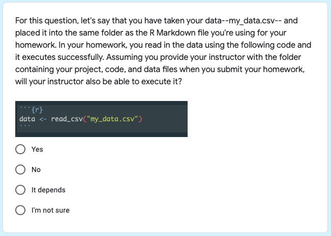

```{r setup, include=FALSE}
options(htmltools.dir.version = FALSE)
library(fertile)
```

```{r xaringan-themer, include=FALSE, warning=FALSE}
library(xaringanthemer)
style_mono_light(base_color = "#23395b")
```

```{css, echo= FALSE}
.remark-code {
  font-size: 24px;
}

.small .remark-code {
  font-size: 80% !important;
}
.tiny .remark-code {
  font-size: 50% !important;
}
```

## Overview

1. What is reproducibility? Why is it lacking?
2. Shortcomings of other attempts to address reproducibility
3. Why `fertile` is different
4. How `fertile` works
5. Potential applications
6. Conclusion
7. Accessing project materials

```{r, echo = FALSE, fig.align='center', out.height=270, out.width=250}

```

---
## What is reproducibility?

> In data science, research is considered fully __reproducible__ when the requisite code and data files produce identical results when run by another analyst.


---
## The benefits of reproducibility

1. Trusting findings

2. Receiving feedback

3. Extending ideas

---
## The reproducibility crisis

*Nature (2016)*: 90% of respondents claim reproducibility "crisis"

Vast majority cannot reproduce others' work, half not even their own.

Other studies have found that some fields have reproducibility rate <10%.

```{r, echo = FALSE, out.width='50%'}
knitr::include_graphics("images/nature-2.png")
```


---
background-image: url("images/tidy-badge.png")
background-position: right bottom
background-size: 30%

## The six major components of reproducibility


### Component 1: Basic project components made accessible to the public:

- Data (raw and/or processed) and metadata

- Code

- Related Software


---
background-image: url("images/structure-badge.png")
background-position: right bottom
background-size: 30%

## The six major components of reproducibility

### Component 2: Well-organized file structure:

- Separate folders for different file types + minimal clutter

- No extraneous files


---
background-image: url("images/documentation-badge.png")
background-position: right bottom
background-size: 30%

## The six major components of reproducibility


### Component 3: The project is documented well:

- Files are clearly named / ordered

- A README is present

- Code contains comments

- Software dependencies are noted


---
background-image: url("images/paths-badge.png")
background-position: right bottom
background-size: 30%

## The six major components of reproducibility


### Component 4: Good file paths:

- All paths should be written as relative to the project directory

    - No paths that are computer dependent!
    - Don't point outside the project directory (e.g. to the desktop)

---
background-image: url("images/randomness-badge.png")
background-position: right bottom
background-size: 30%

## The six major components of reproducibility


### Component 5: Randomness is accounted for:

- If used, seed must be set

---
background-image: url("images/style-badge.png")
background-position: right bottom
background-size: 30%

## The six major components of reproducibility

### Component 6: Code is readable and consistently styled:

- Coherent style

- Follow guide (e.g. `tidyverse`)


---
## Attempts to address reproducibility: journals

```{r, out.width = "60%", echo = FALSE}
knitr::include_graphics("images/stats-journals.png")
```

Limitations:

1. Inconsistent/weak,  2. Often not used because a) Authors lack time/knowledge, or b) Costly for reviewers

---
## Attempts to address reproducibility: educational programs

- Replication studies at Graduate level (Cambridge, Harvard, UNC, Penn State, Berkeley)

- At undergraduate level, requirement for work to be completed in `.Rmd` (Smith, Duke)

Limitations:

1. Most opportunities for graduates
2. Takes time away from other class topics
3. Takes time for professor to set up

---
## Attempts to address reproducibility: software

- `rrtools` / `renv`: dependency management
- `orderly` / `drake` / `reproducible`: automation, makefiles
- `workflowr`: version control

- Continuous integration tools: `wercker`, `GitHub Actions`, `Travis CI`, `Circle CI`.

```{r, echo = FALSE}
knitr::include_graphics('images/ci-tools.png')
```

Limitations: 1. R packages narrow in scope, complex, big learning curve. 2. CI tools lack software specific features

---
background-image: url("images/fertile-hex.png")
background-position: right bottom
background-size: 30%

## Setting `fertile` apart: package goals

1) Simple and straightforward

2) Widely accessible (small learning curve)

3) Addresses variety of reproducibility components

4) R-specific features

5) Customizable to user needs

6) Educational

7) Applicable to many domains


---
## R Projects

`project_miceps`:

```{r, echo = FALSE, out.width = "80%"}
knitr::include_graphics('images/sample-project.png')
```


---

## Component 1: accessible project files

* Check that code/data are present:

- `proj_render()`: execute R files to ensure they compile

- `sandbox()`: copying project to temp directory, ensure success when separated from file system

---
## Component 2: organized project structure

- `has_tidy_` series: check for file clutter 

- `has_only_used_files()`: no unnecessary files

.small[
```{r}
has_only_used_files("project_miceps")
```
]

---
## Component 2: organized project structure

- `proj_move_files()`: organize files to R package structure

- Standardized structure, easily understood

- Simplifies process of converting to package later

---
## Component 3: documentation

- `has_readme()`

- `has_clear_build_chain()`: file order clear

- `has_well_commented_code()`

.small[
```{r, eval = FALSE}
has_well_commented_code("project_miceps")
```

```{r, echo = FALSE}
comments_tbl <- has_well_commented_code("project_miceps")

cat("*", comments_tbl$name, "\n")
cat("Problem:", comments_tbl$problem, "\n")
cat("Solution:", stringr::str_wrap(comments_tbl$solution, width = 60), "\n")
cat("See for help:", stringr::str_wrap(comments_tbl$help, width = 60))

errors <- comments_tbl$error

errors[[1]]
```
]

---
## Component 3: documentation

- `proj_dependency_report()`: captures a list of package dependencies and versions when project is executed in a new environment

- `proj_pkg_script()`: build installation script for dependencies

.small[
```{r, eval = FALSE}
install_script <- proj_pkg_script("project_miceps")
```

```{r, echo = FALSE}
message_print <- "Run this script to install the required packages for this R project. \n Packages hosted on CRAN... \ninstall.packages(c( 'broom', 'dplyr', 'fs', 'ggplot2', 'purrr', 'readr', 'rmarkdown', 'skimr', 'stargazer', 'tidyr' )) \nPackages (likely) hosted on GitHub..."

cat(stringr::str_wrap(message_print, width = 70))


```

]

---
## Component 4: File Paths

- Interactive warning system

.small[
```{r, error=TRUE, eval = FALSE}
read.csv("~/Desktop/my_data.csv")
```

```{r, echo = FALSE}
error_msg <- "Error: Detected absolute paths. Absolute paths are not reproducible and will likely only work on your computer. If you would like to continue anyway, please execute the following command: utils::read.csv('~/Desktop/my_data.csv')"

cat(stringr::str_wrap(error_msg, width = 70))
```

```{r, error=TRUE, eval = FALSE}
read_csv("../../../Desktop/my_data.csv")
```

```{r, echo = FALSE}
error_msg <- "Error: Detected paths that lead outside the project directory. Such paths are not reproducible and will likely only work on your computer. If you would like to continue anyway, please execute the following command: readr::read_csv('../../../Desktop/my_data.csv')"

cat(stringr::str_wrap(error_msg, width = 80))
```


```{r, error=TRUE}
setwd("project_miceps")
```
]

---
## Component 4: File Paths

- Analyze paths in project code

.small[
```{r}
has_no_absolute_paths("project_miceps")
```
]

- `has_only_portable_paths()`: checks for paths outside directory

---
## Component 5: randomness

- Differentiate between `controlled` (seed) & `uncontrolled` (no seed) randomness

.small[
```{r}
has_no_randomness('project_miceps')
```
]

---
## Component 6: readability and style

- `has_no_lint()`

- `tidy` code style (Hadley Wickham)

---
## Overview functions

- `proj_check()`: run a variety of smaller functions addressing 6 components

- `proj_badges()`: earn/display badges for different components, summary of project generation info

```{r badge-graphics, out.width="15%",  fig.show='hold', echo = FALSE}
knitr::include_graphics(c("images/structure-badge.png", "images/tidy-badge.png", "images/documentation-badge.png", "images/paths-badge.png", "images/randomness-badge.png", "images/style-badge.png"))
```

---
## Overview functions

```{r, echo = FALSE, out.width = '75%'}
knitr::include_graphics('images/badges-1.png')
```

---
## Customization

- `proj_check_some()`: run checks by keywords
- `proj_check_badge()`: run checks by badge

- Functions to handle the interactive warning system:
- `add_shim()`: add function
- `edit_shims()`: edit functions
- `load_shims()`: turn on warnings
- `unload_shims()`: turn off warnings

---
## How it works: shims

- Invisibly intercept users' actions and alter them slightly

1. Identify path-accepting function.
2. Create function in `fertile` w/ same name & arguments (+ ...)
3. Write this new function so that it:

a) captures any arguments,

b) logs the name of the function called,

c) performs `fertile` file path checks on these arguments, and

d) calls the original function with the original arguments (passed through ...). 

---
## How it works: shims

- Sample shim for `utils::read.csv`

.small[

```{r}
fertile::read.csv
```

]

---
## How it works: other techniques

- Hidden files created to track behavior:
  - Log functions associated w/ reproducibility
  - Save results of `proj_render`
  
- Environment variables determine which file `fertile` writes to

---

## Disclaimer on malware

- `fertile` could be considered malware

- Will likely not ever be on `CRAN`: 
    - Many dependencies
    - Creating hidden files 
    - Intercepting user behavior w/o knowledge

- However: necessary for features to work, plus code is fully available on GitHub --> complete transparency

---
## Review of Goals

1) `Simple`: functions usually just take one or two arguments

2) `Accessible`: no advanced coding knowledge required

3) `Addresses multiple components`: all six components have functions

4) `R-specific features`: package dependency management, randomness

5) `Customizable`: editing warning system, choosing which checks to run

6) `Educational`: warning messages, checks give explanations and recommendations on failure

7) `Applicable to many domains`


---
## Potential applications: journal review

- Drastically speed up review process, save money
- Two methods: 1. Run fertile checks, 2. Require `proj_badges()` output


```{r, echo = FALSE}
knitr::include_graphics('images/journal-process-2.png')
```

---
## Potential applications: teaching reproducibility

- Introduce reproducibility in more undergrad classrooms

- Limited barriers to entry:
1. R and RStudio installed
2. Know how to install/load GitHub package
3. Know how to create an R project
4. Can run basic functions & input simple file paths

- Smith experiment


---
## Conclusion

- Currently a reproducibility crisis and existing solutions are inadequate

- `fertile` fills gaps where other solutions---in software, education, or journal review--- fail

- Appears to be gaining some traction. Even helping one person improve their reproducibility will be worth it!

```{r, echo = FALSE, out.width = "50%", fig.align = 'center'}
knitr::include_graphics("images/oprah.jpg")
```


---
## How to access project materials

- `r fontawesome::fa("github")` (`fertile`): 
https://github.com/baumer-lab/fertile / https://github.com/ambertin/fertile

- `r fontawesome::fa("github")` (`thesis`):
https://github.com/ambertin/thesis

- `r emo::ji("notebook")` `fertile` paper published in `Stat` journal: https://onlinelibrary.wiley.com/doi/epdf/10.1002/sta4.332

---


# .center[Questions?]


---

## Experimental testing: design

- 2 Sessions: Fall 2020 (18 students), J-Term 2021 (38 students)

- Students randomly divided (w/ blinding) into two groups: `fertile` and no `fertile`

- Measuring reproducibility: post-test (fall) and pre/post- tests (j-term)

- Fall: Final Score, J-Term: Difference in scores

---
## Experimental testing: technical details

Blinding process

1. Students provide unique computer username 

2. Convert that with `md5()` hashing algorithm 

3. Assign hashed names to groups

4. `sds192` package `.onAttach()` pulls username, hashes it, and compares to pre-written assignment

5. If in `fertile` group, `fertile` secretly loaded. If not, just have access to basic `sds192` package features


---

## Experimental testing: results


- No evidence of relationship between `fertile` and test score (or difference in scores)

```{r, echo = FALSE, out.width = "60%", fig.align='center'}

```


- Fall: `fertile` group scored worse overall (not statistically significant) `r fontawesome::fa("arrow-circle-down")`

- J-Term: `fertile` group started and finished worse, but but had bigger score improvements (also not statistically significant) `r fontawesome::fa("arrow-circle-up")`

- Both groups seemed to learn about reproducibility throughout the class


---
## Experimental testing: limitations

- Small sample size

- Non-independent subjects

- Classroom environment not same as true testing environment

- Not an accurate representation of the real-world use of `fertile`

- Hard to know if  `fertile` group's software was behaving correctly the whole semester `r fontawesome::fa("laptop")`


---
## Experimental testing: implications

- Not much in terms of `fertile`

- However, potential for A/B testing of other R software

```{r, echo = FALSE}
knitr::include_graphics("images/a-b_testing.png")
```

---

## Additional Info: Experiment 

- `.onAttach()`:

.tiny[
```{r, eval = FALSE}

# .onAttach() from the sds192 package
# Run automatically any time the sds192 package is loaded

.onAttach <- function(libname, pkgname) {

  # The experimental group gets `fertile` loaded secretly
  if (is_experimental()) {
    suppressMessages(library(fertile))
  }
}

is_experimental <- function(logname = whoami::username()) {
  
  # Students are placed into experimental and control
  # groups but remain anonymous
  fertile_group <- c(
    "f7b0a9d5117b88cecec122f8ba0e52fb",
    "4d0295a810fb8491f91f914771572485",
    "36211a1f19f82ae07aed990b671c9b20",
    "b5d2b72b4f36f3afdce32a8409dc6ea0",
    "d498227fd9e6a4c42494bbebc42f6aa8",
    # ... and so on
  )
  control_group <- c(
    "9aa36583f54766205850428e8f1a4c89", 
    "f03020938b31818063c79d2422755183", 
    "7ec57b1f2bca9ac1e702fb68427b781b", 
    "e5e30623e9d09d29ded851b7fb40cb51", 
    "592572bb9fce168f37117fd0d6e0e5ee",
    # ... and so on
 
  )
  

  digest::digest(logname, algo = "md5") %in% fertile_group
  
}
```
]

---
## Additional Info: Experiment (Fall 2020)

```{r, echo = FALSE,  message = FALSE}
library(readr)
library(tidyverse)


fall2020 <- readr::read_csv("data/Fall_2020_Single_Post_test.csv")
jterm2021 <- readr::read_csv("data/JTerm_2021_Pre_Post.csv")
jterm2021$Test <- factor(jterm2021$Test, levels = c("Pre", "Post"))

```

```{r, echo = FALSE, message = FALSE}
library(RColorBrewer)

fall2020_averages <- fall2020 %>% 
  group_by(Group) %>%
  summarize(Projects_Total = mean(Projects_Total),
            Paths_Total = mean(Paths_Total),
            Overall_Total = mean(Overall_Total)) %>%
  pivot_longer(cols = 2:4, names_to = "Question_Average")

ggplot(fall2020_averages, aes(x = Group, fill = Group, y = value)) + 
  facet_wrap(~Question_Average) + 
  geom_col() +
  ylab("Average Score") +
  scale_fill_brewer(palette = "Paired") +
  xlab(NULL) + 
  ggtitle("Difference in Reproducibility Score Averages, Fall 2020")
```
---
## Additional Info: Experiment (Fall 2020)


```{r, echo = FALSE, message = FALSE}
ggplot(fall2020, aes(x = Previous_Classes, y = Overall_Total, col = Group)) + 
  geom_point(size = 4) +
  scale_color_brewer(palette = "Paired") +
  ggtitle("Previous Classes vs Total Score, Fall 2020") +
  geom_smooth(method = "lm", se = FALSE)
```
---
## Additional Info: Experiment (Fall 2020)

.small[
```{r, echo = FALSE}
fall_model <- lm(Overall_Total ~ Group, data = fall2020)
summary(fall_model)
```
]
---
## Additional Info: Experiment (Fall 2020)

.small[

```{r, echo = FALSE}
fall_model <- lm(Overall_Total ~ Group + Previous_Classes, data = fall2020)
summary(fall_model)
```
]

---
## Additional Info: Experiment (Jan 2021)

```{r, echo = FALSE, message = FALSE}
group_scores <- jterm2021 %>% select(1:5, 15:17) %>%
  rename(Projects = "Projects_Total",
         Paths = "Paths_Total",
         Overall = "Overall_Total") %>%
  pivot_longer(cols = 6:8,
               names_to = "Question_Group",
               values_to = "Score")

ggplot(group_scores, aes(x = Test, y = Score, fill = Group)) +
  geom_boxplot() +
  facet_wrap(~Question_Group) +
  scale_fill_brewer(palette = "Paired") +
  ggtitle("Score Distributions for Pre/Post Tests, J-Term 2021")
```


---
## Additional Info: Experiment (Jan 2021)


```{r, echo = FALSE, message = FALSE, warning = FALSE}
pre_post_differences <- jterm2021 %>% group_by(Student_ID, Group, Previous_Classes) %>%
  summarize(pre_total = ifelse(Test == "Pre", Overall_Total, NA),
            post_total = ifelse(Test == "Post", Overall_Total, NA),
            pre_projects = ifelse(Test == "Pre", Projects_Total, NA),
            post_projects = ifelse(Test == "Post", Projects_Total, NA),
            pre_paths = ifelse(Test == "Pre", Paths_Total, NA),
            post_paths = ifelse(Test == "Pre", Paths_Total, NA)) %>%
  group_by(Student_ID, Group, Previous_Classes) %>%
  summarize(Total = na.omit(post_total) - na.omit(pre_total),
            Projects = na.omit(post_projects) - na.omit(pre_projects),
            Paths = na.omit(post_paths) - na.omit(pre_paths)) %>%
  pivot_longer(cols = 4:6, names_to = "Question_Group", values_to = "Score_Difference")

jterm_model_data <- pre_post_differences %>% 
  filter(Question_Group == "Total")

```


.small[
```{r, echo = FALSE}
jterm_model <- lm(Score_Difference ~ Group, data = jterm_model_data)

summary(jterm_model)
```
]

---
## Additional Info: Experiment (Jan 2021)

.small[
```{r, echo = FALSE}
jterm_model_mr <- lm(Score_Difference ~ Group + Previous_Classes, data = jterm_model_data)

summary(jterm_model_mr)

```
]

---
## Additional Info: Assumptions

### Fall 2020

```{r, echo = FALSE, fig.show="hold", out.width="50%"}
plot(fall_model, which = c(1,2)) 
```

---
## Additional Info: Assumptions

### Jan 2021

```{r, echo = FALSE, fig.show="hold", out.width="50%"}
plot(jterm_model, which = c(1,2))
```

---
## Additional Info: Test Questions

```{r, echo = FALSE, out.width = '80%'}

```

---
## Additional Info: Test Questions

```{r, echo = FALSE, out.width = '80%'}
knitr::include_graphics("images/test-8.png")
```

